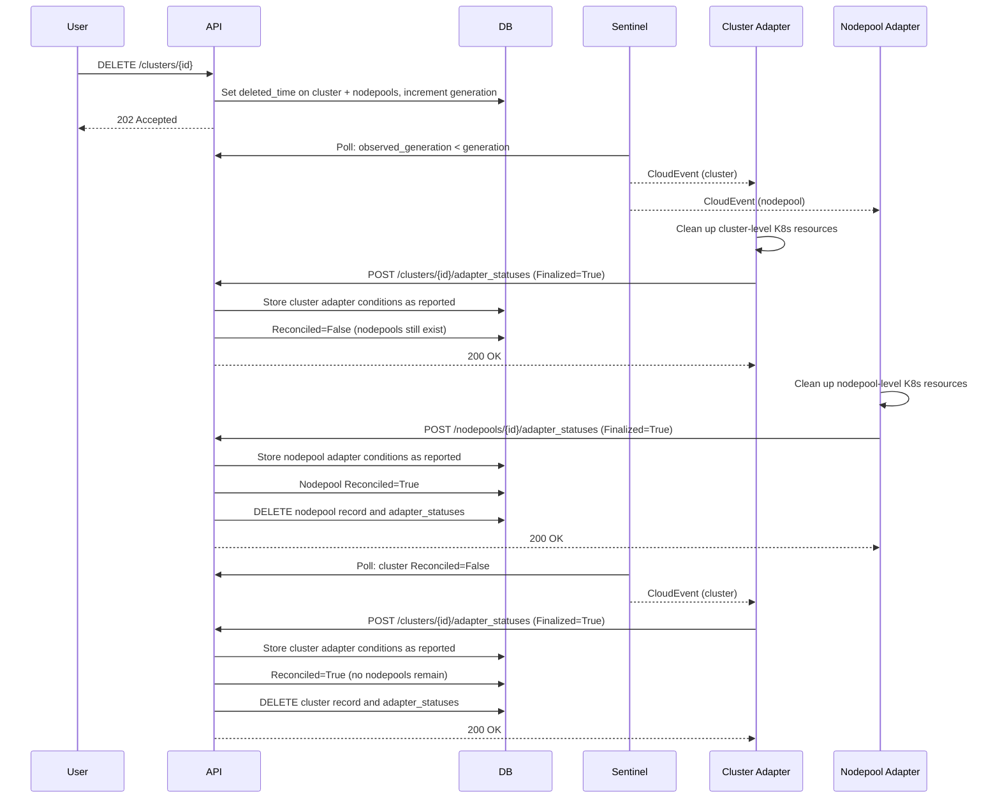

# 0012 — Hard-Delete in Single Request After Adapter Reconciliation

## Context

The [Adapter Deletion Flow Design](../components/adapter/framework/adapter-deletion-flow-design.md) defines **when** hard-delete is triggered (`deleted_time` set + `Reconciled=True`). It defers the **how** — the actor, pattern, and failure handling — to this ADR. In order to unblock the deletion epic (HYPERFLEET-559), this ADR determines how hard-deletion will work. HYPERFLEET-904 drove the design.

**The ownership question:** A cluster can have multiple required adapters (e.g. Validation, DNS, Infra). All must finalize before the cluster can be hard-deleted. A single adapter only knows about its own resources, not whether sibling adapters have finished. This eliminates any individual adapter as the owner.

**The race condition:** When a cluster with 500+ nodepools is deleted, cluster-level adapters (e.g. validation with no infrastructure) may finalize instantly while nodepool-level adapters (e.g. infra via Maestro) take minutes per nodepool. Without ordering enforcement, the cluster record would be hard-deleted while nodepool records remain orphaned with real infrastructure still running on spoke clusters.

## Decision

The **API hard-deletes DB records within the same `POST /adapter_statuses` request** that computes `Reconciled=True`. No new endpoint, component, or broker topic is introduced. The API is the natural owner because it receives every adapter status report, aggregates conditions to compute `Reconciled`, and can hard-delete atomically within the same database transaction.

### How it works

**Bottom-up ordering via Reconciled aggregation:** When the API receives a `POST /clusters/{id}/adapter_statuses` request where the adapter's conditions include `Finalized=True`, it stores the adapter conditions as reported and computes `Reconciled`. The aggregation checks both adapter conditions (all adapters `Finalized=True`?) **and** dependent resources (all nodepool records gone?). If nodepools still exist, `Reconciled` stays `False` even though all cluster adapters report `Finalized=True`. Sentinel sees `Reconciled=False`, re-triggers the event, and cluster adapters report `Finalized=True` again idempotently. Once all nodepools are hard-deleted, the next status update computes `Reconciled=True` and hard-deletes the cluster. `ON DELETE RESTRICT` provides database-level safety.

**Deletion logs:** API emits `deletion_requested` (on DELETE) and `deletion_finalized` (before hard-delete) with `trace_id` for end-to-end correlation.

## Consequences

**Gains:** Small implementation scope (few lines in API status path); atomic transaction prevents partial-deletes; API check prevents race condition by verifying nodepools are gone; clean database (critical at 500+ nodepools); no new infrastructure; natural retry via Sentinel; investigation via existing log aggregation with `trace_id`; consistent with Kubernetes finalizer semantics.

**Trade-offs:** No `GET` after hard-delete (requires log tooling); premature `Finalized=True` from adapter bug = permanent data loss (mitigated by `Health=True` guard); log retention depends on infrastructure (typically 30-90 days); no programmatic deletion history.

**Troubleshooting / observability:** Decided to not retain data. Rather we focus on better logging and in case we need to audit/capture states of our API resources (or k8s resources), we can implement event streaming for the purpose of audits.

## Alternatives Considered

| Alternative | Why Rejected |
|---|---|
| **Adapter calls hard-delete endpoint** | A cluster can have multiple required adapters (Validation, DNS, Infra). A single adapter only knows about its own resources — no visibility into whether sibling adapters have finished cleanup. If Adapter A calls hard-delete while Adapter B still has ManifestWorks running on a spoke cluster, the DB record is gone while real infrastructure remains as untracked orphans. Even if the API endpoint aggregated confirmations, this is functionally identical to the existing `POST /adapter_statuses {Finalized:true}` path — the API still decides. |
| **Sentinel triggers hard-delete** | Sentinel is read-only by design — it polls the API and publishes CloudEvents. Adding mutation capabilities (calling DELETE endpoints) changes Sentinel's role from "watchful guardian" to actor, breaking single-responsibility. Additionally, having Sentinel watch the API just to call an API endpoint adds indirection without adding information — the API already knows when `Reconciled=True` because it computed it. |
| **Retention window + CronJob (viable, deferred)** | Keep records in DB for a configurable period after `Reconciled=True`, then hard-delete via background CronJob. Deferred because no formal investigation requirement exists — peer team interest (office hours) was a nice-to-have, not formalized with acceptance criteria. Teams can build must-gather adapters for retention without changes to the deletion mechanism. The single-request approach evolves to this by swapping DELETE for `SET reconciled_at` statement. |
| **Sentinel-level audit event stream** | Publishes audit events from Sentinel to a dedicated broker topic on state changes. Addresses observability (programmatic event access for dashboards/workflows), not hard-delete execution. Documented as future evolution path — additive enhancement that doesn't require undoing hard-delete in single request. |
