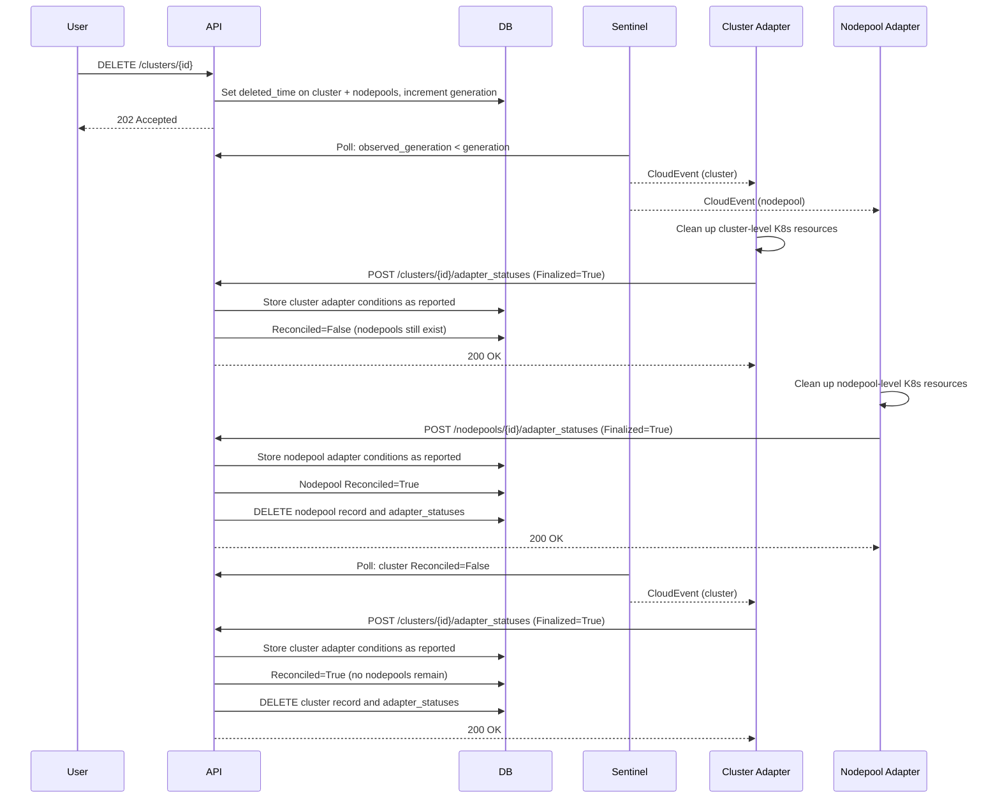
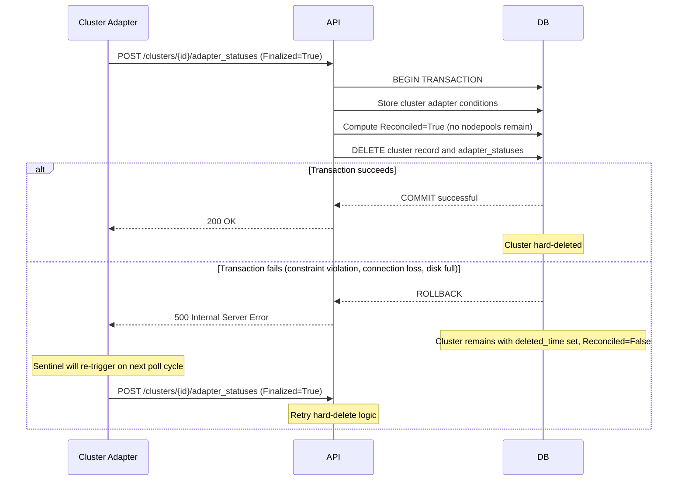

# 0012 — Hard-Delete Ownership and Execution

## Context

**The ownership question:** A cluster can have multiple required adapters. A single adapter only knows about its own resources, not whether sibling adapters have finished. No individual adapter can own hard-delete.

**The race condition:** When a cluster with 500+ nodepools is deleted, cluster adapters may finalize instantly while nodepool adapters take minutes per nodepool. Without ordering enforcement, the cluster would be hard-deleted while nodepools remain orphaned with real infrastructure still running.

> Related: [Adapter Deletion Flow Design](../components/adapter/framework/adapter-deletion-flow-design.md)

## Decision

The **API hard-deletes DB records within the same `POST /adapter_statuses` request** that computes `Reconciled=True`. No new endpoint or component is introduced. The API is the natural owner because it receives every adapter status report, aggregates conditions to compute `Reconciled`, and can hard-delete atomically within the same database transaction.

How bottom-up ordering works (click to expand)

Atomic transaction failure and retry (click to expand)

**Why atomic transactions prevent partial deletes:** The `adapter_status` update and the `DELETE` statement execute in the same database transaction. If the `DELETE` fails, the entire transaction rolls back — the status update is never committed, `Reconciled` remains `False`, and Sentinel will re-trigger the adapter to retry.

**Bottom-up ordering via Reconciled aggregation:**

- When the API receives `POST /clusters/{id}/adapter_statuses` with `Finalized=True`, it stores the adapter conditions as reported and computes `Reconciled`
- The aggregation checks both adapter conditions (all adapters `Finalized=True`?) **and** dependent resources (all nodepool records gone?)
- If nodepools still exist: `Reconciled` stays `False` even though all cluster adapters report `Finalized=True`
- Sentinel sees `Reconciled=False`, re-triggers the event, and cluster adapters report `Finalized=True` again idempotently
- Once all nodepools are hard-deleted: next status update computes `Reconciled=True` and hard-deletes the cluster
- `ON DELETE RESTRICT` on the nodepool→cluster foreign key provides database-level safety, preventing cluster row deletion while nodepool rows still reference it

## Consequences

**Gains:** Small implementation scope (few lines in API status path); atomic transaction prevents partial-deletes; API check prevents race condition by verifying nodepools are gone; clean database (critical at 500+ nodepools); no new infrastructure; natural retry via Sentinel; consistent with Kubernetes finalizer semantics.

**Trade-offs:** No `GET` after hard-delete; investigation requires log tooling; premature `Finalized=True` from adapter bug = permanent data loss (mitigated by Health guard in post-processing that prevents `Finalized=True` when executor didn't complete successfully, and adapters reporting `Finalized=False` with reason `AdapterUnhealthy` when cleanup cannot be confirmed — see [Adapter Deletion Flow Design](../components/adapter/framework/adapter-deletion-flow-design.md#deletion-error-reporting-11)). Future event streaming for audits can be added without changing this mechanism.

**Failure handling:** If the `DELETE` SQL statement fails (database constraint violation, connection loss, disk full), the entire transaction — including the `adapter_status` update that triggered the hard-delete check — rolls back. The resource remains in the database with `deleted_time` set and `Reconciled=False`. Sentinel will re-trigger the event on the next reconciliation cycle, and the adapter will re-report status, retrying the hard-delete logic.

**Adapter re-reporting:** For large clusters (500+ nodepools), the cluster adapter will repeatedly report `Finalized=True` while waiting for nodepool cleanup to complete. Each report triggers the hard-delete check, sees nodepools still exist, and leaves `Reconciled=False`. This generates adapter status updates proportional to Sentinel's polling frequency × nodepool cleanup duration. This behavior is intentional and acceptable for the initial implementation; optimization deferred to future work.

## Alternatives Considered

| Alternative | Why Rejected |
|---|---|
| **Adapter calls hard-delete endpoint** | A cluster can have multiple required adapters (Validation, DNS, Infra). A single adapter only knows about its own resources — no visibility into whether sibling adapters have finished cleanup. If Adapter A calls hard-delete while Adapter B still has ManifestWorks running, the DB record is gone while real infrastructure remains as untracked orphans. Even if the API endpoint aggregated confirmations, this is functionally identical to the existing `POST /adapter_statuses {Finalized:true}` path — the API still decides. |
| **Sentinel triggers hard-delete** | Sentinel is read-only by design — it polls the API and publishes CloudEvents. Adding mutation capabilities (calling DELETE endpoints) changes Sentinel's role from observer to actor, breaking single-responsibility. Additionally, having Sentinel watch the API just to call an API endpoint adds indirection without adding information — the API already knows when `Reconciled=True` because it computed it. |
| **Retention window + CronJob (viable, deferred)** | Keep records in DB for a configurable period after `Reconciled=True`, then hard-delete via background CronJob. Deferred because no formal investigation requirement exists — peer team interest (office hours) was a nice-to-have, not formalized with acceptance criteria. Teams can build must-gather adapters for retention without changes to the deletion mechanism. The single-request approach evolves to this by swapping DELETE for `SET reconciled_at` statement. |
| **Sentinel-level audit event stream** | Publishes audit events from Sentinel to a dedicated broker topic on state changes. Addresses observability (programmatic event access for dashboards/workflows), not hard-delete execution. Documented as future evolution path — additive enhancement that doesn't require undoing hard-delete in single request. |
