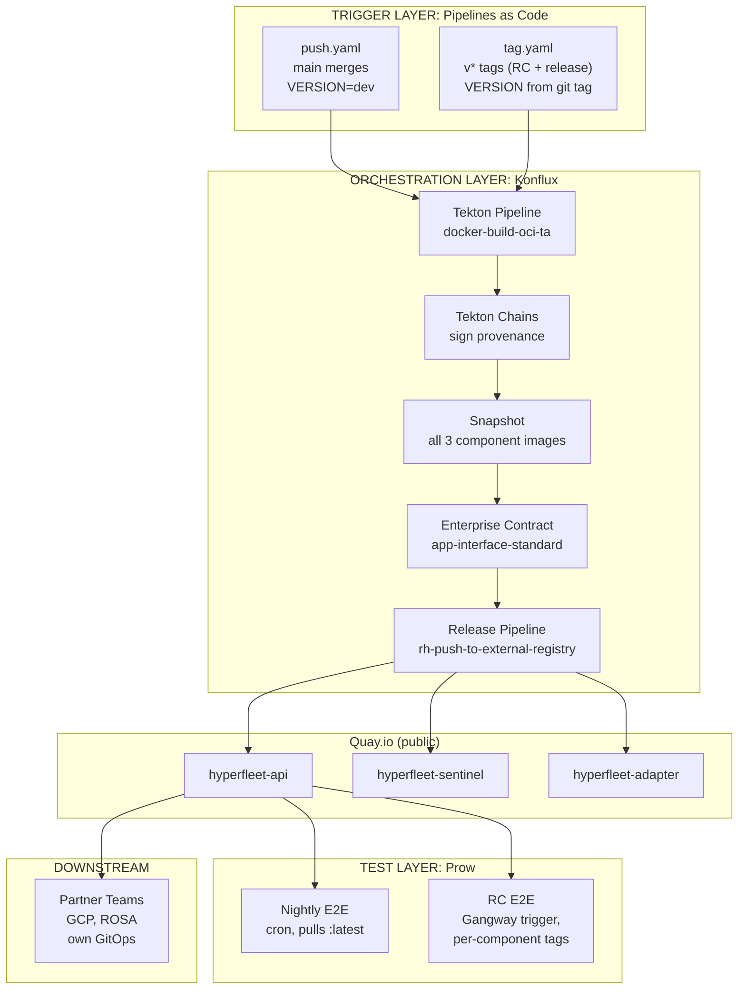
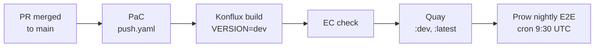
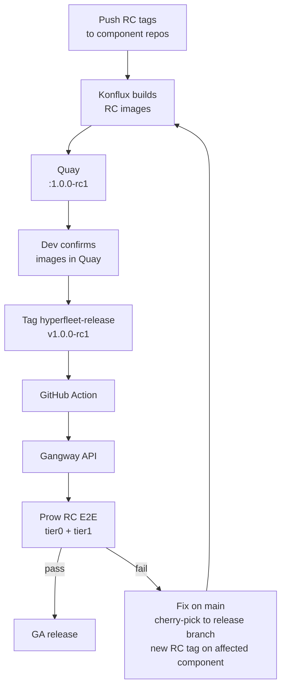
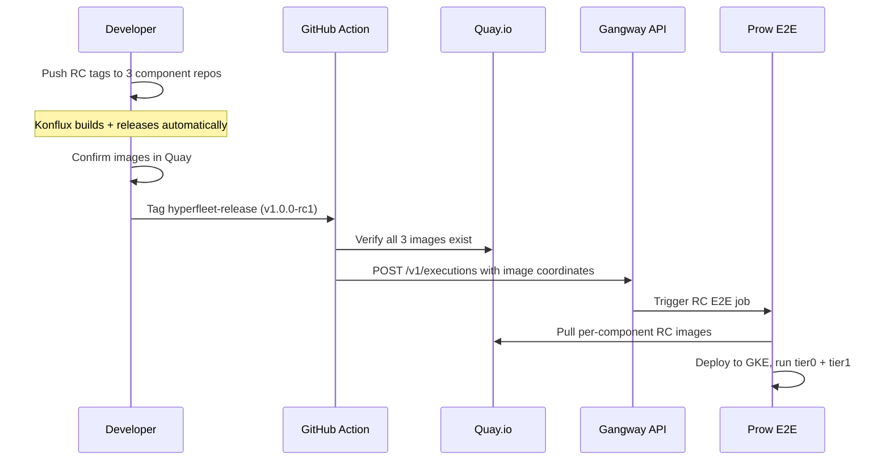

# Konflux Release Pipeline Design

> **Audience:** HyperFleet developers, release owners, and partner teams consuming HyperFleet images.

- **JIRA Spike:** [HYPERFLEET-872](https://redhat.atlassian.net/browse/HYPERFLEET-872)
- **Parent Epic:** [HYPERFLEET-830](https://redhat.atlassian.net/browse/HYPERFLEET-830) (Hyperfleet Components Konflux Onboarding)
- **ADR:** [0014 — Konflux for Container Image Build and Release](../../adrs/0014-konflux-build-and-release.md)

---

## 1. Overview

HyperFleet adopts Konflux for container image build and release, replacing Prow's ci-operator for image production. Prow retains PR validation and E2E testing.

The architecture has three layers:

| Layer | Tool | Responsibility |
|-------|------|----------------|
| **Trigger** | Pipelines as Code (PaC) | Matches git events to `.tekton/` pipelines |
| **Orchestration** | Konflux | Build, sign, validate (EC), release to Quay |
| **Test** | Prow | Nightly E2E, RC E2E, PR presubmits |

**Key decisions:**

- One Application (`hyperfleet`) with three Components (API, Sentinel, Adapter)
- Single RPA with auto-release for all build contexts (nightly, RC, GA)
- Tag-based triggers using CEL expressions (globs cannot distinguish RC from release tags)
- `app-interface-standard` Enterprise Contract policy
- `rh-push-to-external-registry` release pipeline with Pyxis and Slack
- RC E2E triggered via `hyperfleet-release` repo tag -> GitHub Action -> Gangway -> Prow

---

## 2. Background

### Current State (Prow)

- ci-operator builds images to `registry.ci.openshift.org`
- No provenance records, no SBOM, no image signing
- RC testing requires per-release-branch Prow pipeline definitions
- Manual image promotion process

### Target State (Konflux + Prow)

| Aspect | Changes | Stays the Same |
|--------|---------|----------------|
| Image build | Prow ci-operator -> Konflux Tekton | Same Dockerfiles, same source |
| Image registry | `registry.ci.openshift.org` -> `quay.io` (public) | Same image content |
| Image signing | None -> Tekton Chains + cosign | New capability |
| PR checks | Prow presubmit stays | Same validation purpose |
| E2E testing | Still Prow | Same tests, same GKE cluster, different image source |
| RC testing | Per-branch Prow config -> single reusable Prow job | Same E2E suite, much simpler config |
| Release process | Manual -> PaC tag-triggered + auto-release | Same release branch strategy |

---

## 3. Architecture



### What Lives Where

| Component | Location | Owner |
|-----------|----------|-------|
| PaC pipeline definitions (`.tekton/`) | Component repos (hyperfleet-api, sentinel, adapter) | HyperFleet team |
| PaC controller | Konflux cluster (kflux-prd-rh02) | Konflux platform team |
| Tekton Chains (signing) | Konflux cluster | Konflux platform team |
| RPA (registry mapping, tags, policy) | `konflux-release-data` repo | HyperFleet team |
| Enterprise Contract policy selection | `konflux-release-data` repo (RPA references policy) | HyperFleet team |
| Prow E2E jobs | `openshift/release` repo | HyperFleet team |

---

## 4. End-to-End Release Flows

### Nightly (Day-to-Day Development)



### RC Testing



### Fix Cycle

1. Fix merged to main first (PR with tests)
2. Cherry-pick to affected component's release branch (only the component with the bug)
3. New RC tag on affected component only (e.g., tag `v1.5.0-rc2` on the hyperfleet-api repo)
4. Konflux builds new RC image
5. Update `RELEASE_MANIFEST.yaml`, tag `hyperfleet-release`
6. Prow E2E retests. Repeat until green.

For the full bug triage process including severity assessment and decision framework, see [Bug Handling Workflow](./hyperfleet-release-process.md#5-bug-handling-workflow-after-code-freeze).

### GA Release

There is no automated gate between E2E and release — the human is the gate. The Release Owner must verify E2E passed before pushing GA tags. This is a deliberate choice: `block-releases` cannot distinguish release Snapshots from nightly ones (see [RPA Design](#releaseplanadmission-design)), and the ITS Prow wrapper that could automate this is a fast-follow item.

**Before pushing GA tags, the Release Owner MUST:**
1. Confirm the RC E2E Prow job passed for the final RC commit SHA (check Prow dashboard)
2. Confirm all three RC images exist in Quay at the expected tags
3. Confirm no regressions in nightly E2E since the RC was cut

**GA release steps:**
1. Tag each component with GA version (`v1.5.0`, `v1.4.2`, `v2.0.0`)
2. Each tag triggers Konflux build with version injection -> auto-release to Quay
3. Pyxis registration and Slack notification (automatic)
4. Update `RELEASE_MANIFEST.yaml` to GA versions
5. Tag `hyperfleet-release` with GA tag -> GitHub Release with release notes
6. Smoke tests against GA images
7. Partner teams notified, consume versioned images from Quay via their own GitOps

### Complete Timeline

```
Week 1-2: Development
  main ──PR──PR──PR──PR──► Konflux builds → Quay :dev :latest (continuous)
                                              Prow nightly E2E (daily)

Week 3: Release
  Day 1:   Feature freeze. Create release branches.
  Day 1-2: RC1 tags → Konflux → Quay → Prow E2E
  Day 2-3: Fix cycle (if needed): fix → main → cherry-pick → RC2
  Day 4-5: GA tags → Konflux → Quay → smoke tests → partner notification

Post-Release:
  Prow nightly continues on :latest (main builds)
  Release branches maintained for 6 months
  Hotfixes: main first → cherry-pick → patch tag (no RC needed)
```

### Hotfix Process

Hotfixes target 1 working day turnaround for Blocker/Critical issues. Patches skip the RC cycle.

| Aspect | Full Release (Week 3) | Hotfix (1 working day) |
|--------|----------------------|-------------------|
| Scope | All components, all features | Single fix, single component |
| RC cycle | RC1 -> E2E -> fix -> RC2 -> ... | No RC — straight to patch tag |
| E2E testing | Full tier0 + tier1 | Focused smoke test |
| Approvals | Release readiness review | Code review + Release Owner |
| Konflux builds | Multiple (per RC) | One (affected component only) |
| Timeline | 5 working days | 1 working day |

**Hotfix flow:**

```
Fix on main → cherry-pick to release branch → push patch tag (v1.5.1)
  → PaC tag.yaml triggers → Konflux builds (~10-15 min)
  → Auto-release to Quay → Pyxis + Slack (automatic)
  → Smoke test → update manifest → notify partners
```

**Severity targets:**

| Severity | Target | Process |
|----------|--------|---------|
| Blocker / Critical CVE | 1 working day | Full hotfix process. Developer assigned immediately. |
| All other issues | 2 working days | Patch within 2 working days, or defer to next release. |

---

## 5. Tag-Based Release Triggers

### Why CEL, Not Globs

PaC uses [gobwas/glob](https://github.com/gobwas/glob) for `on-target-branch` matching. Globs support `*`, `?`, `[a-z]`, `{alt1,alt2}` but have **no negative matching and no regex**.

- `refs/tags/v*-rc*` matches RC tags. Works.
- `refs/tags/v*` matches ALL tags including RCs. **No way to exclude `-rc*`.**

CEL expressions with RE2 regex anchoring solve this. Verified against PaC source code and [openshift/hypershift production configuration](https://github.com/openshift/hypershift/pull/5869).

### Pipeline Files Per Component Repo

Each component repo gets **two** `.tekton/` pipeline files:

**1. Push pipeline** — `hyperfleet-<component>-push.yaml`

Triggers on every merge to main. Builds with `VERSION=dev` (the Dockerfile default).

```yaml
metadata:
  annotations:
    pipelinesascode.tekton.dev/on-event: "[push]"
    pipelinesascode.tekton.dev/on-target-branch: "[main]"
```

**2. Tag pipeline** — `hyperfleet-<component>-tag.yaml`

Triggers on all version tags (RC and release). Extracts version from the tag and passes it as a build arg.

```yaml
metadata:
  annotations:
    pipelinesascode.tekton.dev/on-cel-expression: |
      event == "push"
      && target_branch.matches("^refs/tags/v[0-9]+\\.[0-9]+\\.[0-9]+(-rc[0-9]+)?$")
```

This single CEL expression matches both `v1.0.0-rc1` and `v1.0.0`. Both contexts use the same build steps — the only difference is the version string injected.

RC and release tags produce identical pipelines. A separate release-tag pipeline can be split out later if behaviour diverges.

### Version Injection Chain

```
git tag v1.5.0-rc1
  → PaC extracts {{ target_branch }} = "refs/tags/v1.5.0-rc1"
    → Pipeline task strips prefix and v: TAG_NAME="1.5.0-rc1"
      → Build arg: --build-arg VERSION=1.5.0-rc1
        → Dockerfile: ARG VERSION=dev → LABEL version="${VERSION}"
          → RPA tag template: {{ labels.version }} = "1.5.0-rc1"
            → Quay tag: hyperfleet-api:1.5.0-rc1
```

Main merges use the Dockerfile default (`VERSION=dev`), producing `hyperfleet-api:dev`.

> **Note:** Git tags use the `v` prefix (e.g., `v1.5.0`). The pipeline strips the `v` before injecting into the build, so Quay image tags do **not** have the prefix (e.g., `hyperfleet-api:1.5.0`). This is intentional.

### Build Pipeline Type

`docker-build-oci-ta` (trusted artifacts). Uses OCI artifacts for data sharing between tasks (not PVCs), so the Enterprise Contract `trusted_task.trusted` policy passes even with pipeline customisations like version extraction tasks. Supports `build-args` for VERSION injection.

> **Note:** The build pipeline type can be changed after the fact. If multi-arch support (e.g., amd64 + arm64) is needed later, switching to `docker-build-multi-platform-oci-ta` is a one-line change per pipeline file.

### Dockerfile Requirements

Existing Dockerfiles work with one addition:

```dockerfile
ARG VERSION=dev
# ... build stages ...
LABEL version="${VERSION}"
```

- Base images: UBI images are public, accessible from Konflux
- Dependencies: All Go modules are public, no vendoring needed

---

## 6. Multi-Component Configuration

### Application and Components

One Application (`hyperfleet`) with three Components:

| Component | Git Repo | Target Registry |
|-----------|----------|-----------------|
| `hyperfleet-api` | `github.com/openshift-hyperfleet/hyperfleet-api` | `quay.io/redhat-services-prod/hyperfleet/hyperfleet-api` |
| `hyperfleet-sentinel` | `github.com/openshift-hyperfleet/hyperfleet-sentinel` | `quay.io/redhat-services-prod/hyperfleet/hyperfleet-sentinel` |
| `hyperfleet-adapter` | `github.com/openshift-hyperfleet/hyperfleet-adapter` | `quay.io/redhat-services-prod/hyperfleet/hyperfleet-adapter` |

When any Component builds, the resulting Snapshot contains images for ALL Components (the new build plus the last known images for the other two).

### ReleasePlanAdmission Design

The RPA configuration lives in `konflux-release-data` as the source of truth. Refer to the actual config files for current YAML:

- **RPA:** `config/kflux-prd-rh02.0fk9.p1/service/ReleasePlanAdmission/hyperfleet/`
- **Constraint:** `constraints/service/hyperfleet.yaml`

**Design rationale:**

- **Single RPA** listing all three components. One RPA, one tag template, three distinct outcomes driven by `{{ labels.version }}`.
- **Auto-release** (`block-releases: false`). `block-releases` is per-RPA, not per-Snapshot — every Snapshot from the Application matches every RPA. A gated RPA would block every nightly and RC build, creating hundreds of blocked releases never intended to be unblocked. The tag push IS the gate.
- **Release pipeline:** `rh-push-to-external-registry`. Pushes to Quay, registers in Pyxis (vulnerability scanning), and sends Slack notifications. Every non-Konflux service team on kflux-prd-rh02 uses this pipeline.
- **Tag templates** using `{{ labels.version }}`, `{{ labels.version }}-{{ timestamp }}`, `{{ git_sha }}`, and `latest`.

### Image Tags Per Build Context

All from the same RPA, differentiated by `{{ labels.version }}`:

| Build Context | `labels.version` | Quay Tags |
|--------------|-------------------|-----------|
| Nightly (main) | `dev` | `dev`, `dev-20260415093000`, `latest`, `a1b2c3d` |
| RC tag | `1.0.0-rc1` | `1.0.0-rc1`, `1.0.0-rc1-20260415140000`, `b2c3d4e` |
| Release tag | `1.0.0` | `1.0.0`, `1.0.0-20260415160000`, `c3d4e5f` |

---

## 7. Enterprise Contract Policy

**Policy:** `app-interface-standard`

This is the standard policy for Red Hat service-type releases. It validates:

- Provenance records exist and are signed
- Acceptable Tekton bundles were used
- Base images are from trusted sources

It **excludes** (not relevant for services):

- CVE scanning gate (advisory, not blocking)
- Source container requirements
- Preflight container certification

**Fast-follow:** Create a custom `app-interface-hyperfleet-prod` policy that re-enables CVE scanning once the team has data from initial builds.

---

## 8. Prow E2E Integration

### Nightly E2E

One PR to `openshift/release` changes the nightly Prow job to pull images from public Quay instead of `registry.ci.openshift.org`:

```yaml
env:
  IMAGE_REGISTRY: quay.io
  API_IMAGE_REPO: redhat-services-prod/hyperfleet/hyperfleet-api
  API_IMAGE_TAG: latest
```

Prow tests the actual Konflux-built artifact. No ITS wrapper, no migration. Public Quay images eliminate pull secret complexity.

### RC E2E

RC testing is triggered via the `hyperfleet-release` repo, which coordinates all three components:



**Retrigger without a new tag:**

```bash
gh workflow run rc-e2e.yaml -f tag=1.0.0-rc1 --repo openshift-hyperfleet/hyperfleet-release
```

**Gangway setup (one-time):**

1. Request Gangway access via `#forum-ocp-testplatform` Slack
2. Create rover group and generate long-lived token via `./hack/gangway_token.py` in `openshift/release`
3. PR to `openshift/release`: add RC E2E job definition + whitelist in Gangway config
4. Store token as `GANGWAY_TOKEN` secret in `hyperfleet-release` repo

### RELEASE_MANIFEST.yaml

The manifest in `hyperfleet-release` is a **coordination artifact for Prow E2E triggering** — it tells the GitHub Action which image tags to pass to Gangway. It is not the build source of truth; Konflux Snapshots are. Each Snapshot records exactly which images were built and at which commits.

The manifest exists because Prow E2E needs to test a specific combination of component versions, and Konflux has no concept of "these three independent builds belong together." The manifest is the human-maintained bridge between independent per-component Konflux builds and the coordinated E2E test.

```yaml
components:
  hyperfleet-api: 1.5.0-rc1
  hyperfleet-sentinel: 1.4.2-rc1
  hyperfleet-adapter: 2.0.0-rc1
```

The Release Owner updates the manifest manually before tagging `hyperfleet-release`. The GitHub Action then verifies the listed images exist in Quay before triggering E2E — this catches drift between the manifest and what was actually built.

---

## 9. Trade-offs

**Gains:**

- SLSA Level 3 supply chain security (provenance, SBOM, signing) with zero extra configuration
- Auto-release eliminates manual image publishing on every merge
- Single reusable Prow job replaces per-release-branch pipeline definitions for RC testing
- Public Quay images remove pull secret complexity for Prow and partner environments
- Pyxis registration enables Red Hat vulnerability scanning automatically
- Alignment with Red Hat release engineering standards

**Trade-offs:**

- Two build systems during transition period: Konflux for images, Prow for PR validation and E2E
- RC E2E triggering depends on Gangway API availability (mitigated by retrigger via `gh workflow run`)
- Team must learn Konflux primitives (RPA, ITS, PaC, Snapshots, EC)
- No automated gate prevents releasing without E2E pass. The Release Owner is the gate — they must verify E2E passed before pushing GA tags (see [GA Release](#ga-release) checklist). Risk: accidental tag push or Gangway failure means E2E never ran but images are in Quay. Mitigated by the release checklist and fast-follow ITS that will add an automated safety net.

---

## 10. Alternatives Considered

| Alternative | Why Rejected |
|-------------|--------------|
| Full Prow (status quo) | No path to SLSA compliance. No provenance, SBOM, or signing. Does not meet Red Hat release engineering requirements. |
| Full Konflux (including E2E) | Replicating GKE provisioning, GCP credentials, and hyperfleet-e2e framework inside Konflux ITS is high cost, low benefit. Prow already works. |
| ITS wrapper for Prow E2E | A Tekton pipeline that triggers Prow via Gangway and polls for results. Adds complexity (polling, timeouts, error handling) when a simpler GitHub Action achieves the same with better DX. Deferred to fast-follow if automated gating is needed. |
| Separate RPAs per build context | One auto-release RPA for nightly + one gated for releases. `block-releases` is per-RPA not per-Snapshot, so every build creates blocked releases — noise without safety. |
| Glob patterns for tag matching | PaC globs cannot distinguish `v1.0.0-rc1` from `v1.0.0`. No negative matching. CEL with regex anchoring is required. |
| Migrate E2E to Konflux | Prow already has GKE clusters, GCP credentials, the test framework, and the deploy scripts. Migration cost is not justified. |
| Single shared RC version across all components | Tagging all three components with the same RC version when only one has a fix. Rejected because it wastes build time, conflates unchanged components with the fix, and makes it harder to track which component actually changed. The chosen model is independent per-component RC versioning: only the affected component gets a new RC tag, and `RELEASE_MANIFEST.yaml` tracks the tested combination. |

---

## 11. Fast-Follow Items

| Item | Description |
|------|-------------|
| ITS Prow wrapper | IntegrationTestScenario that queries Prow API to verify E2E passed for the commit SHA before release. Adds automated safety net without `block-releases` noise. |
| Custom EC policy | `app-interface-hyperfleet-prod` re-enabling CVE scanning. Needs data from initial builds. |
| Multi-arch builds | Switch to `docker-build-multi-platform-oci-ta` if arm64 deployment target materializes. One-line change per pipeline. |

---

